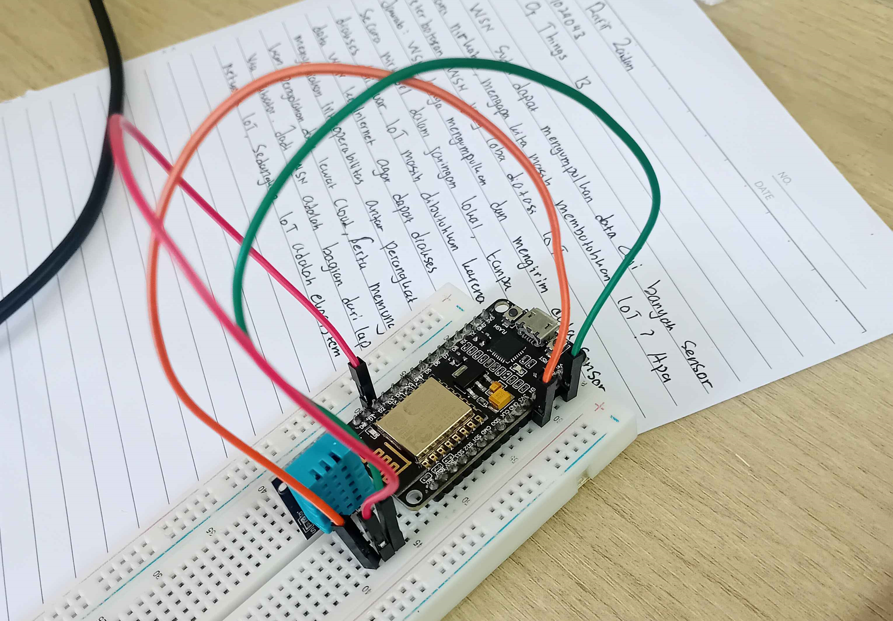
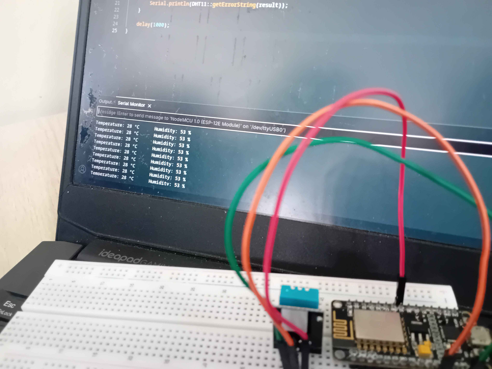
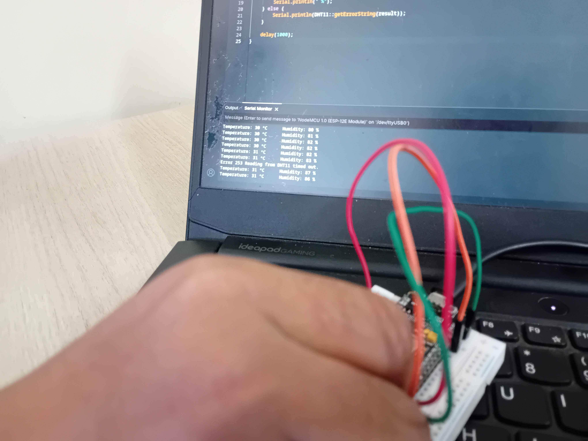
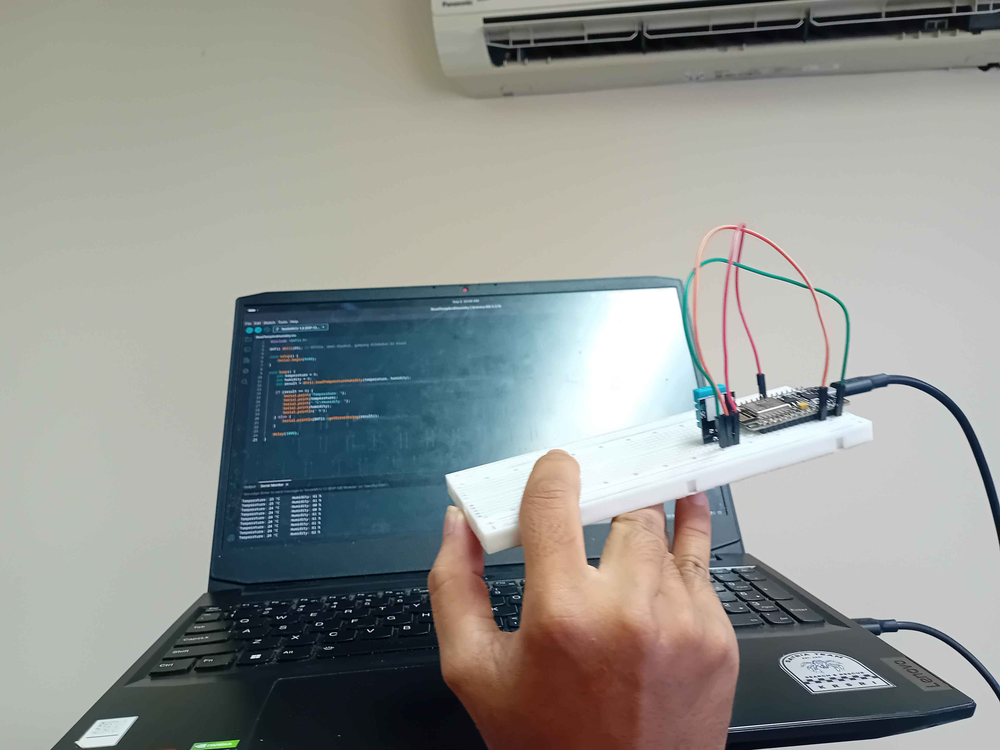
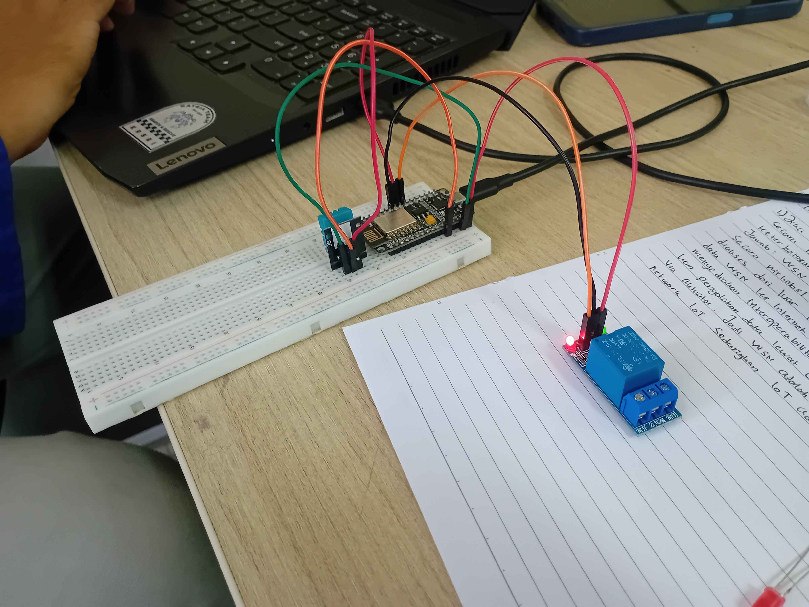
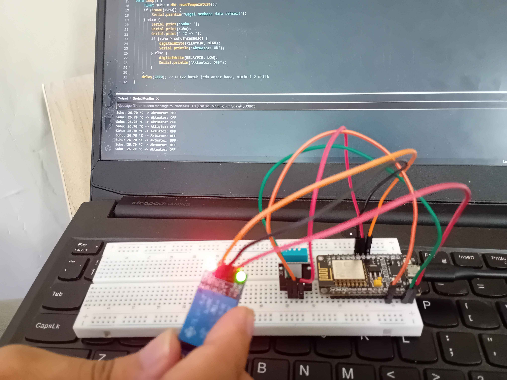

# Modul 1 - Sensor Dan Aktuator
## Penjelasan Kode
### Percobaan 1A - Akuisis Data Sensor DHT22 <hr>

Pada percobaan pertama, kita akan menguji sebuah sensor DHT11 untuk membaca suhu ruangan selama beberapa detik.

```cpp
#include <DHT11.h> // Import  library DHT11

DHT11 dht11(D5);   // GPIO14, aman dipakai, gampang ditemukan di board

void setup() {
    Serial.begin(9600); // Jalankan serial monitor dengan baud rate 9600
}

void loop() {
    // Inisialisasi variable
    int temperature = 0;
    int humidity = 0;

    // Membaca suhu dan kelembapan dari sensor
    int result = dht11.readTemperatureHumidity(temperature, humidity);

    // Error handling apabila result mengembalikan nilai error (selain 0),
    // Menampilkan temperatur dan kelembapan pada serial monitor jika result
    // mengembalikan nilai 0
    if (result == 0) {
        // Print output dalam format "Temperature: n °C  Humidity: n %"
        Serial.print("Temperature: ");
        Serial.print(temperature);
        Serial.print(" °C\tHumidity: ");
        Serial.print(humidity);
        Serial.println(" %");
    } else {
        Serial.println(DHT11::getErrorString(result)); // Print err message
    }

    delay(1000); // Delay satu detik
}
```
### Library
- DHT11

### Percobaan 2A - Kendali Aktuator Relay<hr>

Pada percobaan kedua, kita akan mengkombinasikan aktuator Relay dengan rangkaian percobaan pertama untuk mengendalikan sebuah LED sebagai indikator apabila nilainya melewati batas.

```cpp
#include <DHT.h> // Import DHT

// Definisikan nilai environment
#define DHTPIN D5 // GPIO14 - untuk sensor DHT22
#define DHTTYPE DHT11
#define RELAYPIN D6 // GPIO12 - untuk kendali relay/LED

DHT dht(DHTPIN, DHTTYPE); // Deklarasi dht
const float suhuThreshold = 30.0; // Inisialisasi threshold

void setup() {
    Serial.begin(115200);
    dht.begin(); // inisialisasi
    pinMode(RELAYPIN, OUTPUT); // Set RELAYPIN ke mode OUTPUT
    digitalWrite(RELAYPIN, LOW); // Nilai awal RELAYPIN
}

void loop() {
    float suhu = dht.readTemperature(); // membaca temperatur dari sensor
    if (isnan(suhu)) { // Cek apakah suhu tidak valid atau bukan angka
        Serial.println("Gagal membaca data sensor!");
    } else { // Jika valid print suhu ke serial
        Serial.print("Suhu: ");
        Serial.print(suhu);
        Serial.print(" °C -> ");
        if (suhu > suhuThreshold) { // Jika suhu melebihi threshold
            digitalWrite(RELAYPIN, HIGH); // Nyalakan LED
            Serial.println("Aktuator: ON"); // print Aktuator: ON
        } else { // Jika tidak
            digitalWrite(RELAYPIN, LOW); // Matikan LED
            Serial.println("Aktuator: OFF");// print Aktuator: OFF
        }
    }
    delay(2000); // DHT22 butuh jeda antar baca, minimal 2 detik
}
```
### Library
- DHT (Adafruit)

<br>

## Pertanyaan Praktikum
### Percobaan 1A <hr>

>Modifikasi program agar data suhu dan kelembaban dirata-ratakan dari 5 kali pembacaan sebelum ditampilkan, dan berikan penjelasan di setiap baris kode yang ditambahkan dalam bentuk README.md!

```cpp
#include <DHT.h>

DHT dht(21, DHT22);
int count, max_count = 5;
float t_temp, h_temp;

void setup() {
    Serial.begin(9600);
}

void loop() {
    int t = dht.readTemperature();
    int h = dht.readHumidity();

    if (isnan(t) || isnan(h)) {
        Serial.println("error dht22");
    } else if (count < max_count) {
        t_temp += t;
        h_temp += h;
        count++;
    } else {
        Serial.print("Temperature: ");
        Serial.print(t_temp/max_count);
        Serial.print(" °C\tHumidity: ");
        Serial.print(h_temp/max_count);
        Serial.println(" %");

        count = t_temp = h_temp = 0;
    }

    delay(2000);
}
```

```cpp
...
// Inisialisasi variable baru
int count, max_count = 5;   // count untuk menyimpan iterasi dan max_count menghentikan iterasi
float t_temp, h_temp;       // menyimpan nilai total dari tiap iterasi
...
```

```cpp
...
// Penambahan percabangan baru dengan kondisi apabila count kurang dari max_count
// tambahkan nilai temperatur (t) ke t_temp dan humidity (h) ke h_temp
if (isnan(t) || isnan(h)) {
    Serial.println("error dht22");
} else if (count < max_count) {
    t_temp += t;
    h_temp += h;
    count++;
} else {
    Serial.print("Temperature: ");
    Serial.print(t_temp/max_count); // t_temp / max_count untuk mendapatkan rerata temperatur
    Serial.print(" °C\tHumidity: ");
    Serial.print(h_temp/max_count); // h_temp / max_count untuk mendapatkan rerata temperatur
    Serial.println(" %");

    count = t_temp = h_temp = 0;    // reset
}
...
```

### Percobaan 2A <hr>

>Modifikasi program agar menggunakan dua ambang batas (histerisis), misalnya aktuator menyala pada suhu di atas 30°C dan baru mati pada suhu di bawah 28°C, dan berikan penjelasan di setiap baris kode nya dalam bentuk README.md!

```cpp
#include <DHT.h>

#define DHTPIN 21
#define DHTTYPE DHT22
#define RELAYPIN 26

DHT dht(DHTPIN, DHTTYPE);
const float suhuThresholdUp = 30.0;
const float suhuThresholdBottom = 28.0;
bool isActive;

void setup() {
    Serial.begin(115200);
    dht.begin();
    pinMode(RELAYPIN, OUTPUT);
    digitalWrite(RELAYPIN, LOW);
}

void loop() {
    float suhu = dht.readTemperature();
    if (isnan(suhu)) {
        Serial.println("Gagal membaca data sensor!");
    } else {
        Serial.print("Suhu: ");
        Serial.print(suhu);
        Serial.print(" °C -> ");
        if (suhu < suhuThresholdBottom) isActive = false;
        else if (suhu > suhuThresholdUp) isActive = true;
        if (isActive) {
          digitalWrite(RELAYPIN, HIGH);
          Serial.println("Aktuator: ON");
        } else {
          digitalWrite(RELAYPIN, LOW);
          Serial.println("Aktuator: OFF");
        }
    }
    delay(2000);
}
```

```cpp
...
// Inisialisasi variable baru
const float suhuThresholdUp = 30.0;
const float suhuThresholdBottom = 28.0; // tambahan threshold bawah
bool isActive;  // menyimpan state relay
...
```

```cpp
...
// Pengkondisian state aktif untuk relay
if (suhu < suhuThresholdBottom) isActive = false;   // relay mati ketika melewati batas bawah
else if (suhu > suhuThresholdUp) isActive = true;   // relay hidup ketika  melewati batas atas

// Pengkondisian untuk set pin relay
// dan print status aktuator ke serial
if (isActive) {
    digitalWrite(RELAYPIN, HIGH);
    Serial.println("Aktuator: ON");
} else {
    digitalWrite(RELAYPIN, LOW);
    Serial.println("Aktuator: OFF");
}
...
```

<br>

## Dokumentasi
### Percobaan 1A

<div align="center">
    
    
    
    
</div>

### Percobaan 2A

<div align="center">
    
    
</div>