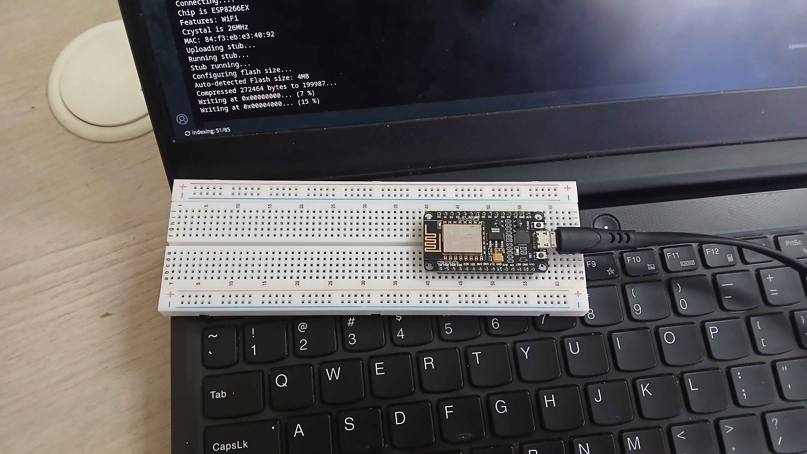
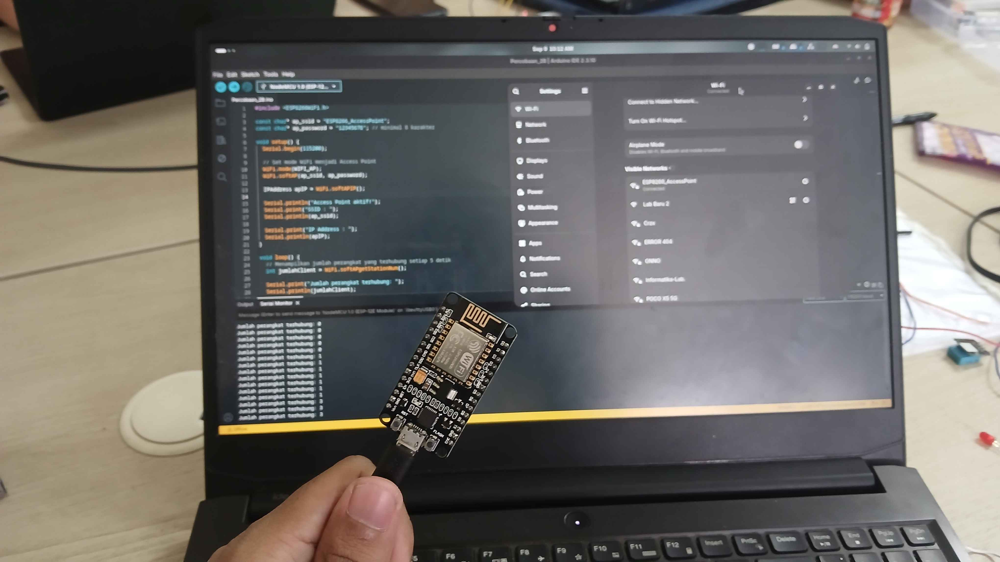

# Modul 1 - Konfigurasi Jaringan
## Penjelasan Kode
### Percobaan 2A - Konfigurasi Mode Station (STA) <hr>

Pada percobaan pertama, kita mengkonfigurasi WiFi ESP8266 dalam mode station sebagai penerima internet.

```cpp
#include <ESP8266WiFi.h>

// Kredensial hotspot yang akan dihubungkan
const char* ssid     = "mad";
const char* password = "dang4444";

const int ledPin = D2;   // LED indikator status koneksi

void setup() {
    Serial.begin(115200);

    // Set mode LED dan matikan saat program dijalankan
    pinMode(ledPin, OUTPUT);
    digitalWrite(ledPin, LOW);

    // Set mode WiFi menjadi Station
    WiFi.mode(WIFI_STA);
    WiFi.begin(ssid, password);

    Serial.print("Menghubungkan ke WiFi");
    // Pengulangan untuk mengecek koneksi WiFi hingga terhubung
    while (WiFi.status() != WL_CONNECTED) {
        delay(500);
        Serial.print(".");
    }

    // Jika berhasil terhubung,
    // Print IP, MAC, dan kuat sinyal WiFi
    Serial.println();
    Serial.println("WiFi berhasil terhubung!");
    Serial.print("IP Address  : ");
    Serial.println(WiFi.localIP());
    Serial.print("MAC Address : ");
    Serial.println(WiFi.macAddress());
    Serial.print("RSSI (dBm)  : ");
    Serial.println(WiFi.RSSI());

    digitalWrite(ledPin, HIGH);  // nyalakan LED sebagai indikator
}

void loop() {
    // Cek status koneksi setiap 5 detik
    if (WiFi.status() == WL_CONNECTED) {
        Serial.println("Status: Terhubung"); // Print status ketika terhubung
    } else {
        Serial.println("Status: Terputus"); // Print status ketika terputus
        digitalWrite(ledPin, LOW); // Matikan LED
    }

    // Print IP, MAC, dan kuat sinyal WiFi
    Serial.print("IP Address  : ");
    Serial.println(WiFi.localIP());
    Serial.print("MAC Address : ");
    Serial.println(WiFi.macAddress());
    Serial.print("RSSI (dBm)  : ");
    Serial.println(WiFi.RSSI());
    delay(5000);
}
```
### Library
- ESP8266WiFi

### Percobaan 2B - Konfigurasi Mode Access Point (AP)<hr>

Pada percobaan kedua, kita akan mengkonfigurasikan ESP8266 sebagai penyedia jaringan atau internet ke perangkat melalui mode Access Point.

```cpp
#include <ESP8266WiFi.h>

// Kredensial WiFi untuk perangkat yang akan terhubung
const char* ap_ssid = "ESP8266_AccessPoint";
const char* ap_password = "12345678"; // minimal 8 karakter

void setup() {
    Serial.begin(115200);

    // Set mode WiFi menjadi Access Point
    WiFi.mode(WIFI_AP);
    WiFi.softAP(ap_ssid, ap_password);

    IPAddress apIP = WiFi.softAPIP(); // Simpan IP lokal

    // Print SSID dan IP ketika AP berhasil dijalankan
    Serial.println("Access Point aktif!");
    Serial.print("SSID : ");
    Serial.println(ap_ssid);

    Serial.print("IP Address : ");
    Serial.println(apIP);
}

void loop() {
    // Menampilkan jumlah perangkat yang terhubung setiap 5 detik
    int jumlahClient = WiFi.softAPgetStationNum();

    Serial.print("Jumlah perangkat terhubung: ");
    Serial.println(jumlahClient);

    delay(5000);
}
```
### Library
- ESP8266WiFi

<br>

## Pertanyaan Praktikum
### Percobaan 2A <hr>

>Modifikasi program agar ESP32 mencoba menghubungkan ulang (reconnect) secara otomatis apabila koneksi WiFi terputus, dan berikan penjelasan di setiap baris kode yang ditambahkan dalam bentuk README.md!

```cpp
#include <WiFi.h>

const char* ssid     = "Wokwi-GUEST";
const char* password = "";

const int ledPin = 2;
int count = 0;

void setup() {
    Serial.begin(115200);

    pinMode(ledPin, OUTPUT);
    digitalWrite(ledPin, LOW);

    WiFi.mode(WIFI_STA);
}

void loop() {
    if (WiFi.status() == WL_CONNECTED) {
      Serial.println("Status: Terhubung");
    } else {
      Serial.println("Status: Terputus");
      digitalWrite(ledPin, LOW);

      WiFi.begin(ssid, password);
      Serial.print("Menghubungkan ke WiFi");
      
      while (WiFi.status() != WL_CONNECTED) {
        delay(500);
        Serial.print(".");
      }

      Serial.println();
      Serial.println("WiFi berhasil terhubung!");

      digitalWrite(ledPin, HIGH);
    }

    Serial.print("IP Address  : ");
    Serial.println(WiFi.localIP());
    Serial.print("MAC Address : ");
    Serial.println(WiFi.macAddress());
    Serial.print("RSSI (dBm)  : ");
    Serial.println(WiFi.RSSI());
    Serial.println();
    
    count++;
    if (count > 2) {
      WiFi.disconnect();
      count = 0;
    }

    delay(5000);
}
```

```cpp
...
} else {
    Serial.println("Status: Terputus");
    digitalWrite(ledPin, LOW);

    /*  bagian kode di bawah merupakan bagian dari void setup yang dipindahkan
        ke dalam percabangan else yaitu ketika WiFi terputus dari koneksi.
        setelah LED mati, WiFi akan segera menghubungkan kembali ke WiFi dengan
        WiFi.begin() hingga terkoneksi dan menyalakan LED kembali.
    */
    WiFi.begin(ssid, password);
    Serial.print("Menghubungkan ke WiFi");

    while (WiFi.status() != WL_CONNECTED) {
    delay(500);
    Serial.print(".");  // print '.' hingga status WiFi terkoneksi
    }

    Serial.println();
    Serial.println("WiFi berhasil terhubung!");

    digitalWrite(ledPin, HIGH);
}
...
```
```cpp
...
int count = 0;  // state iterasi mensimulasikan disconnect
...
/*  simulasi WiFi yang terputus dalam simulasi Wokwi.
*/
count++;
if (count > 2) {
    WiFi.disconnect();
    count = 0;
}
...
```


### Percobaan 2B <hr>

>Modifikasi program agar ESP32 berjalan pada mode AP+STA (terhubung ke WiFi rumah sekaligus menyediakan Access Point), dan berikan penjelasan di setiap baris kode nya dalam bentuk README.md!

```cpp
#include <WiFi.h>

const char* ap_ssid = "ESP8266_AccessPoint";
const char* ap_password = "12345678";
const char* sta_ssid = "Wokwi-GUEST";
const char* sta_password = "";

const int ledPin = 2;

void setup() {
    Serial.begin(115200);

    pinMode(ledPin, OUTPUT);
    digitalWrite(ledPin, LOW);

    WiFi.mode(WIFI_AP_STA);
    WiFi.softAP(ap_ssid, ap_password);

    IPAddress apIP = WiFi.softAPIP(); 

    Serial.println("Access Point aktif!");
    Serial.print("SSID : ");
    Serial.println(ap_ssid);

    Serial.print("IP Address : ");
    Serial.println(apIP);

    WiFi.begin(sta_ssid, sta_password);
    Serial.print("Menghubungkan ke WiFi");
    while (WiFi.status() != WL_CONNECTED) {
      delay(500);
      Serial.print(".");
    }
    Serial.println();
    Serial.print("STA terhubung ke ssid: ");
    Serial.println(WiFi.SSID());
    digitalWrite(ledPin, HIGH);
}

void loop() {
    int jumlahClient = WiFi.softAPgetStationNum();

    Serial.print("Jumlah perangkat terhubung: ");
    Serial.println(jumlahClient);

    delay(5000);
}
```
```cpp
/*  penambahan variable baru untuk menyimpan nilai
    ssid dan password STA dan pin LED
*/
const char* sta_ssid = "Wokwi-GUEST";
const char* sta_password = "";

const int ledPin = 2;
```
```cpp
/*  set LED ke mode output dan matikan saat program baru berjalan.
    Ubah mode WiFi ke AP+STA dengan WIFI_AP_STA
*/
pinMode(ledPin, OUTPUT);
digitalWrite(ledPin, LOW);

WiFi.mode(WIFI_AP_STA);
```
```cpp
/*  mulai koneksi WiFi STA dengan WiFi.begin() kemudian jalankan loop
    print serial hingga WiFi terkoneksi.
    setelah terkoneksi print ssid STA dan nyalakan LED.
*/
WiFi.begin(sta_ssid, sta_password);
Serial.print("Menghubungkan ke WiFi");
while (WiFi.status() != WL_CONNECTED) {
    delay(500);
    Serial.print(".");
}
Serial.println();
Serial.print("STA terhubung ke ssid: ");
Serial.println(WiFi.SSID());
digitalWrite(ledPin, HIGH);
```

<br>

## Dokumentasi
### Percobaan 1A

<div align="center">
    
</div>

### Percobaan 2A

<div align="center">
    
    
</div>