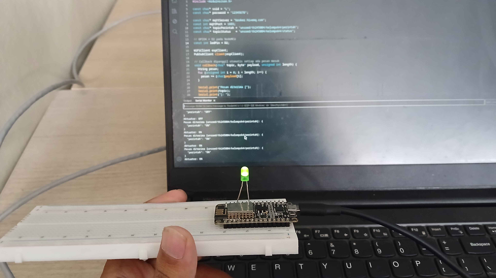
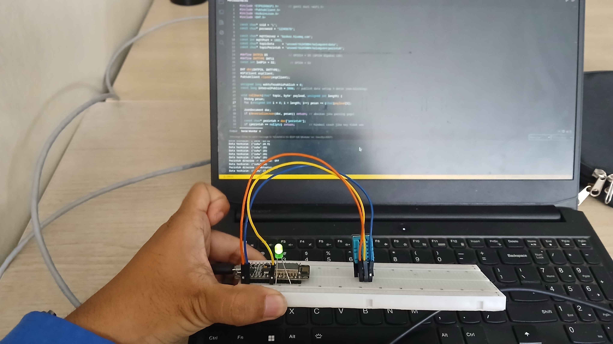

# Modul 4 - Komunikasi dan Pertukaran Data
## Penjelasan Kode
### Percobaan 4A - Subscribe dan Deserialisasi Data <hr>

Pada percobaan pertama, kita akan mencoba menerima data perintah dari broker dengan menjadi subscriber topik tertentu.

```cpp
#include <ESP8266WiFi.h>
#include <PubSubClient.h>
#include <ArduinoJson.h>

const char* ssid = "L";
const char* password = "12345678";

const char* mqttServer = "broker.hivemq.com";
const int mqttPort = 1883;
/*  Varible untuk publish dan subscribe data ke/dari broker sesuai topik.
*   Topik perintah menerima data aksi aktuator.
*   Topik status mengirim status validasi data json.
*/
const char* topicPerintah = "unsoed/tk245004/kelompok4/perintah";
const char* topicStatus   = "unsoed/tk245004/kelompok4/status";

// GPIO4 = D2 pada NodeMCU
const int ledPin = D2;

WiFiClient espClient;
PubSubClient client(espClient);

// Callback dipanggil otomatis setiap ada pesan masuk
void callback(char* topic, byte* payload, unsigned int length) {
    String pesan;
    /*  Pengulangan untuk memasukkan tiap karakter
    *   data dari payload ke variable pesan.
    */
    for (unsigned int i = 0; i < length; i++) {
        pesan += (char)payload[i];
    }

    // Print pesan
    Serial.print("Pesan diterima [");
    Serial.print(topic);
    Serial.print("]: ");
    Serial.println(pesan);

    // Deserialisasi JSON
    JsonDocument doc;
    DeserializationError error = deserializeJson(doc, pesan);

    /*  Pengkondisian jika gagal deserialize maka
    *   publish status ke topicStatus dan hentikan
    *   fungsi callback.
    */
    if (error) {
        Serial.print("Gagal parsing JSON: ");
        Serial.println(error.c_str());
        client.publish(topicStatus, "{\"error\":\"JSON tidak valid\"}");
        return;
    }

    /*  Memanfaatkan data perintah hasil subscribe
    *   untuk menggerakan aktuator berdasarkan nilainya.
    *   ON == Nyalakan LED dan publish pesan "Aktuator: ON"
    *   OFF == Matikan LED dan publish pesan "Aktuator: OFF"
    *   Selain perintah diatas akan diabakikan.
    *   Jika perintah kosong maka print warning.
    */
    const char* perintah = doc["perintah"];
    if (perintah == nullptr) {
        Serial.println("Key 'perintah' tidak ditemukan");
        client.publish(topicStatus, "{\"error\":\"key perintah tidak ada\"}");
        return;
    }

    if (String(perintah) == "ON") {
        digitalWrite(ledPin, HIGH);
        Serial.println("Aktuator: ON");
        client.publish(topicStatus, "{\"aktuator\":\"ON\"}");
    } else if (String(perintah) == "OFF") {
        digitalWrite(ledPin, LOW);
        Serial.println("Aktuator: OFF");
        client.publish(topicStatus, "{\"aktuator\":\"OFF\"}");
    } else {
        Serial.println("Perintah tidak dikenal");
        client.publish(topicStatus, "{\"error\":\"perintah tidak dikenal\"}");
    }
}

void hubungkanWiFi() {
    WiFi.mode(WIFI_STA);
    WiFi.begin(ssid, password);
    Serial.print("Menghubungkan ke WiFi");
    while (WiFi.status() != WL_CONNECTED) {
        delay(500);
        Serial.print(".");
    }
    Serial.println("\nWiFi berhasil terhubung!");
    Serial.print("IP: ");
    Serial.println(WiFi.localIP());
}

void hubungkanMQTT() {
    while (!client.connected()) {
        Serial.print("Menghubungkan ke broker MQTT...");
        String clientId = "ESP8266Client-" + String(random(0xffff), HEX);
        if (client.connect(clientId.c_str())) {
            Serial.println("berhasil terhubung!");
            client.subscribe(topicPerintah);  // subscribe client ke topik perintah
            client.publish(topicStatus, "{\"status\":\"online\"}");
            Serial.print("Subscribe ke topic: ");
            Serial.println(topicPerintah);
        } else {
            Serial.print("gagal, rc=");
            Serial.print(client.state());
            Serial.println(" coba lagi dalam 2 detik");
            delay(2000);
        }
    }
}

void setup() {
    Serial.begin(115200);
    pinMode(ledPin, OUTPUT);
    digitalWrite(ledPin, LOW);
    hubungkanWiFi();
    client.setServer(mqttServer, mqttPort);
    client.setCallback(callback); // set callback sebagai fungsi callback ketika pesan baru masuk
}

void loop() {
    if (!client.connected()) {
        hubungkanMQTT();
    }
    client.loop();  // wajib dipanggil terus-menerus
}
```
### Library
- ESP8266WiFi
- PubSubClient
- ArduinoJSON

### Percobaan 4B - Pertukaran Data Dua Arah<hr>

Pada percobaan kedua, kita buat EPS8266 untuk mengirim dan menerima data ke/dari broker.

```cpp
#include <ESP8266WiFi.h>      // ganti dari <WiFi.h>
#include <PubSubClient.h>
#include <ArduinoJson.h>
#include <DHT.h>

const char* ssid = "L";
const char* password = "12345678";

const char* mqttServer = "broker.hivemq.com";
const int mqttPort = 1883;
/*  Varible untuk publish dan subscribe data ke/dari broker sesuai topik.
*   Topik perintah menerima data aksi aktuator.
*   Topik data mengirim data hasil sensor DHT.
*/
const char* topicData     = "unsoed/tk245004/kelompok4/data";
const char* topicPerintah = "unsoed/tk245004/kelompok4/perintah";

#define DHTPIN D5             // GPIO14 = D5 (GPIO4 dipakai LED)
#define DHTTYPE DHT11
const int ledPin = D2;         // GPIO4 = D2

DHT dht(DHTPIN, DHTTYPE);
WiFiClient espClient;
PubSubClient client(espClient);

unsigned long waktuTerakhirPublish = 0;
const long intervalPublish = 5000; // publish data setiap 5 detik (non-blocking)

void callback(char* topic, byte* payload, unsigned int length) {
    String pesan;
    /*  Pengulangan untuk memasukkan tiap karakter
    *   data dari payload ke variable pesan.
    */
    for (unsigned int i = 0; i < length; i++) pesan += (char)payload[i];

    JsonDocument doc;
    if (deserializeJson(doc, pesan)) return; // abaikan jika parsing gagal

    const char* perintah = doc["perintah"];
    if (perintah == nullptr) return;         // hindari crash jika key tidak ada

    /*  Memanfaatkan data perintah hasil subscribe
    *   untuk menggerakan aktuator berdasarkan nilainya.
    *   ON == Nyalakan LED dan publish pesan "Aktuator: ON"
    *   Selain perintah diatas akan mematikan LED.
    */
    digitalWrite(ledPin, String(perintah) == "ON" ? HIGH : LOW);
    Serial.print("Perintah diterima -> Aktuator: ");
    Serial.println(perintah);
}

void hubungkanWiFi() {
    WiFi.mode(WIFI_STA);
    WiFi.begin(ssid, password);
    Serial.print("Menghubungkan ke WiFi");
    while (WiFi.status() != WL_CONNECTED) {
        delay(500);
        Serial.print(".");
    }
    Serial.println("\nWiFi berhasil terhubung!");
}

void hubungkanMQTT() {
    while (!client.connected()) {
        String clientId = "ESP8266Client-" + String(random(0xffff), HEX);
        if (client.connect(clientId.c_str())) {
            client.subscribe(topicPerintah);
            Serial.println("Terhubung dan subscribe topic perintah");
        } else {
            Serial.print("Gagal MQTT, rc=");
            Serial.println(client.state());
            delay(2000);
        }
    }
}

void setup() {
    Serial.begin(115200);
    pinMode(ledPin, OUTPUT);
    digitalWrite(ledPin, LOW);
    dht.begin();
    hubungkanWiFi();
    client.setServer(mqttServer, mqttPort);
    client.setCallback(callback); // set callback sebagai fungsi callback ketika pesan baru masuk
}

void loop() {
    if (!client.connected()) hubungkanMQTT();
    client.loop(); // memproses pesan masuk secara terus-menerus

    /*  Publish data sensor secara berkala tanpa memblokir proses subscribe.
    *   fungsi millis() akan mengembalikan nilai milisekon
    *   setelah waktu ESP8266 berjalan yang nilainya bisa dibandingkan
    *   dengan nilai millis() sebelumnya yang disimpan pada waktuTerakhirPublish
    *   untuk mendapatkan waktu yang sudah terlampau, kemudian dibandingkan
    *   dengan intervalPublish yang bernilai 5000 milisekon (5 detik).
    */
    if (millis() - waktuTerakhirPublish > intervalPublish) {
        waktuTerakhirPublish = millis();

        float suhu = dht.readTemperature();
        if (!isnan(suhu)) {
            JsonDocument doc;
            doc["suhu"] = suhu;
            char buffer[128];
            serializeJson(doc, buffer);
            client.publish(topicData, buffer);
            Serial.print("Data terkirim: ");
            Serial.println(buffer);
        } else {
            Serial.println("Gagal membaca sensor DHT22");
        }
    }
}
```
### Library
- ESP8266WiFi
- PubSubClient
- DHT
- ArduinoJSON

<br>

## Pertanyaan Praktikum
### Percobaan 4A <hr>

>Modifikasi program agar data JSON yang diterima juga memuat nilai intensitas (misalnya {"perintah": "ON", "intensitas": 200}) yang digunakan untuk mengatur kecerahan LED menggunakan PWM (analogWrite/ledcWrite), dan berikan penjelasan di setiap baris kode yang ditambahkan dalam bentuk README.md

```cpp
#include <WiFi.h>
#include <PubSubClient.h>
#include <ArduinoJson.h>

const char* ssid = "Wokwi-GUEST";
const char* password = "";

const char* mqttServer = "broker.hivemq.com";
const int mqttPort = 1883;
const char* topicPerintah = "unsoed/tk245004/kelompok4/perintah";
const char* topicStatus   = "unsoed/tk245004/kelompok4/status";

const int ledPin = 4;

WiFiClient espClient;
PubSubClient client(espClient);

void callback(char* topic, byte* payload, unsigned int length) {
  String pesan;
  for (unsigned int i = 0; i < length; i++) {
    pesan += (char)payload[i];
  }

  Serial.print("Pesan diterima [");
  Serial.print(topic);
  Serial.println("]: ");
  Serial.println(pesan);

  JsonDocument doc;
  DeserializationError error = deserializeJson(doc, pesan);

  if (error) {
    Serial.print("Gagal parsing JSON: ");
    Serial.println(error.c_str());
    client.publish(topicStatus, "{\"error\":\"JSON tidak valid\"}");
    return;
  }

  const char* perintah = doc["perintah"];
  const int intensitas = doc["intensitas"];
  if (perintah == nullptr) {
    Serial.println("Key 'perintah' tidak ditemukan");
    client.publish(topicStatus, "{\"error\":\"key perintah tidak ada\"}");
    return;
  }

  char buf[128];
  snprintf(buf, sizeof(buf), "{\"aktuator\":\"%S\",\"intensitas\":%d}", perintah, intensitas);

  if (String(perintah) == "ON") {
    intensitas || intensitas == 0 ? analogWrite(ledPin, intensitas) : analogWrite(ledPin, 255);
    Serial.println("Aktuator: ON");
    Serial.print("Intensitas: ");
    Serial.println(intensitas || intensitas == 0 ? (String)intensitas : "100");
    client.publish(topicStatus, buf);
  } else if (String(perintah) == "OFF") {
    analogWrite(ledPin, 0);
    Serial.println("Aktuator: OFF");
    client.publish(topicStatus, buf);
  } else {
    Serial.println("Perintah tidak dikenal");
    client.publish(topicStatus, "{\"error\":\"perintah tidak dikenal\"}");
  }
}

void hubungkanWiFi() {
  WiFi.mode(WIFI_STA);
  WiFi.begin(ssid, password);
  Serial.print("Menghubungkan ke WiFi");
  while (WiFi.status() != WL_CONNECTED) {
    delay(500);
    Serial.print(".");
  }
  Serial.println("\nWiFi berhasil terhubung!");
  Serial.print("IP: ");
  Serial.println(WiFi.localIP());
}

void hubungkanMQTT() {
  while (!client.connected()) {
    Serial.print("Menghubungkan ke broker MQTT...");
    String clientId = "ESP8266Client-" + String(random(0xffff), HEX);
    if (client.connect(clientId.c_str())) {
      Serial.println("berhasil terhubung!");
      client.subscribe(topicPerintah);  // subscribe client ke topik perintah
      client.publish(topicStatus, "{\"status\":\"online\"}");
      Serial.print("Subscribe ke topic: ");
      Serial.println(topicPerintah);
    } else {
      Serial.print("gagal, rc=");
      Serial.print(client.state());
      Serial.println(" coba lagi dalam 2 detik");
      delay(2000);
    }
  }
}

void setup() {
  Serial.begin(115200);
  pinMode(ledPin, OUTPUT);
  digitalWrite(ledPin, LOW);
  hubungkanWiFi();
  client.setServer(mqttServer, mqttPort);
  client.setCallback(callback);
}

void loop() {
  if (!client.connected()) {
    hubungkanMQTT();
  }
  client.loop();
}
```

```cpp
const char* perintah = doc["perintah"];
// variable untuk menyimpan nilai intensitas
const int intensitas = doc["intensitas"];
if (perintah == nullptr) {
    Serial.println("Key 'perintah' tidak ditemukan");
    client.publish(topicStatus, "{\"error\":\"key perintah tidak ada\"}");
    return;
}

// char buffer untuk menyimpan payload json yang akan dipublish
char buf[128];
snprintf(buf, sizeof(buf), "{\"aktuator\":\"%S\",\"intensitas\":%d}", perintah, intensitas);

if (String(perintah) == "ON") {
    // jika intensitas tidak memiliki nilai maka nyalakan led intensitas max
    intensitas || intensitas == 0 ? analogWrite(ledPin, intensitas) : analogWrite(ledPin, 255);
    Serial.println("Aktuator: ON");
    Serial.print("Intensitas: ");
    // print intensitas, jika tidak ada nilai print 255
    Serial.println(intensitas || intensitas == 0 ? (String)intensitas : "255");
    client.publish(topicStatus, buf);
} else if (String(perintah) == "OFF") {
    analogWrite(ledPin, 0);
    Serial.println("Aktuator: OFF");
    client.publish(topicStatus, buf);
} else {
    Serial.println("Perintah tidak dikenal");
    client.publish(topicStatus, "{\"error\":\"perintah tidak dikenal\"}");
}
```

<br>

## Pertanyaan Praktikum
### Percobaan 4B <hr>

>Modifikasi program agar menambahkan satu topic perintah baru untuk mengendalikan aktuator kedua (misalnya buzzer), dengan fungsi callback yang dapat membedakan topic mana yang menerima pesan, dan berikan penjelasan di setiap baris kode yang ditambahkan dalam bentuk README.md!

```cpp
#include <WiFi.h>
#include <PubSubClient.h>
#include <ArduinoJson.h>
#include <DHT.h>

const char* ssid = "Wokwi-GUEST";
const char* password = "";

const char* mqttServer = "broker.hivemq.com";
const int mqttPort = 1883;
const char* topicData     = "unsoed/tk245004/kelompok4/data";
const char* topicPerintahLED = "unsoed/tk245004/kelompok4/perintah/led";
const char* topicPerintahBuzzer = "unsoed/tk245004/kelompok4/perintah/buzzer";

#define DHTPIN 21
#define DHTTYPE DHT22
const int ledPin = 4;
const int buzzPin = 23;

DHT dht(DHTPIN, DHTTYPE);
WiFiClient espClient;
PubSubClient client(espClient);

unsigned long waktuTerakhirPublish = 0;
const long intervalPublish = 5000;

void callback(char* topic, byte* payload, unsigned int length) {
    String pesan;
    for (unsigned int i = 0; i < length; i++) pesan += (char)payload[i];

    JsonDocument doc;
    if (deserializeJson(doc, pesan)) return;

    const char* perintah = doc["perintah"];
    if (perintah == nullptr) return;

    if ((String)topic == topicPerintahBuzzer) (String)perintah == "ON" ? tone(buzzPin, 250) : noTone(buzzPin);
    else if ((String)topic == topicPerintahLED) digitalWrite(ledPin, String(perintah) == "ON" ? HIGH : LOW);
    else {
        Serial.println("Topik perintah tidak diketahui");
        return;
    }
    Serial.print("Perintah diterima -> Aktuator");
    Serial.print("[");
    Serial.print(topic);
    Serial.print("]: ");
    Serial.println(perintah);
}

void hubungkanWiFi() {
    WiFi.mode(WIFI_STA);
    WiFi.begin(ssid, password);
    Serial.print("Menghubungkan ke WiFi");
    while (WiFi.status() != WL_CONNECTED) {
        delay(500);
        Serial.print(".");
    }
    Serial.println("\nWiFi berhasil terhubung!");
}

void hubungkanMQTT() {
    while (!client.connected()) {
        String clientId = "ESP8266Client-" + String(random(0xffff), HEX);
        if (client.connect(clientId.c_str())) {
            client.subscribe(topicPerintahLED);
            client.subscribe(topicPerintahBuzzer);
            Serial.println("Terhubung dan subscribe topic perintah");
        } else {
            Serial.print("Gagal MQTT, rc=");
            Serial.println(client.state());
            delay(2000);
        }
    }
}

void setup() {
    Serial.begin(115200);
    pinMode(ledPin, OUTPUT);
    pinMode(buzzPin, OUTPUT);
    ledcSetup(0, 1000,10);
    ledcAttachPin(buzzPin, 0);
    digitalWrite(ledPin, LOW);
    noTone(buzzPin);
    dht.begin();
    hubungkanWiFi();
    client.setServer(mqttServer, mqttPort);
    client.setCallback(callback);
}

void loop() {
    if (!client.connected()) hubungkanMQTT();
    client.loop();

    if (millis() - waktuTerakhirPublish > intervalPublish) {
        waktuTerakhirPublish = millis();

        float suhu = dht.readTemperature();
        if (!isnan(suhu)) {
            JsonDocument doc;
            doc["suhu"] = suhu;
            char buffer[128];
            serializeJson(doc, buffer);
            client.publish(topicData, buffer);
            Serial.print("Data terkirim: ");
            Serial.println(buffer);
        } else {
            Serial.println("Gagal membaca sensor DHT22");
        }
    }
}
```

```cpp
// memisahkan topik untuk perintah led dan buzzer
const char* topicPerintahLED = "unsoed/tk245004/kelompok4/perintah/led";
const char* topicPerintahBuzzer = "unsoed/tk245004/kelompok4/perintah/buzzer";
```

```cpp
// variable untuk pin buzzer
const int buzzPin = 23;
```

```cpp
void callback(char* topic, byte* payload, unsigned int length) {
    String pesan;
    for (unsigned int i = 0; i < length; i++) pesan += (char)payload[i];

    JsonDocument doc;
    if (deserializeJson(doc, pesan)) return;

    const char* perintah = doc["perintah"];
    if (perintah == nullptr) return;

    // memisahkan perintah berdasarkan topik dari pesan yang diterima.
    if ((String)topic == topicPerintahBuzzer) (String)perintah == "ON" ? tone(buzzPin, 250) : noTone(buzzPin);
    else if ((String)topic == topicPerintahLED) digitalWrite(ledPin, String(perintah) == "ON" ? HIGH : LOW);
    else {
        Serial.println("Topik perintah tidak diketahui");
        return;
    }
    Serial.print("Perintah diterima -> Aktuator");
    Serial.print("[");
    Serial.print(topic);
    Serial.print("]: ");
    Serial.println(perintah);
}
```

```cpp
/*  tambahan setup untuk aktuator buzzer,
*   ledc digunakan untuk suppress warning
*   ledc belum terinisialisasi karena penggunaan
*   fungsi tone().
*/
pinMode(buzzPin, OUTPUT);
ledcSetup(0, 1000,10);
ledcAttachPin(buzzPin, 0);
```

<br>

## Dokumentasi
### Percobaan 4A

<div align="center">
    
</div>

### Percobaan 4B

<div align="center">
    
</div>